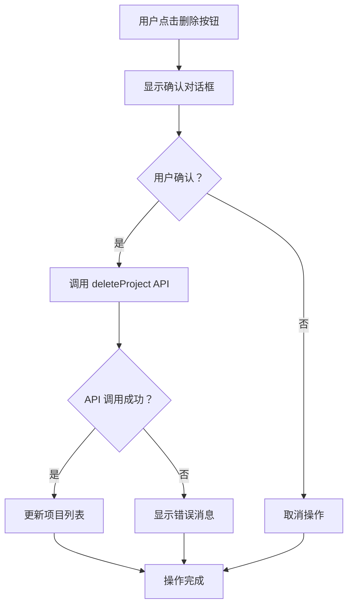
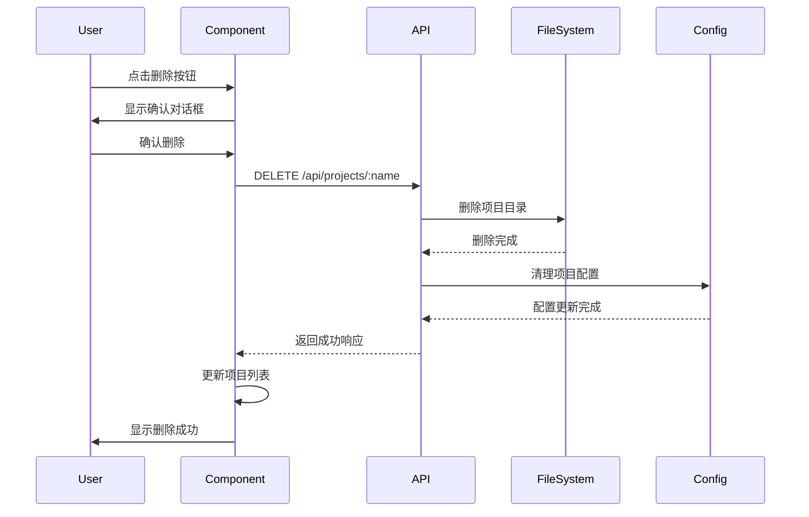

# 项目删除功能增强设计文档

## 1. 设计概述

**功能名称**: 项目删除功能增强  
**设计版本**: v1.0  
**设计日期**: 2025-08-12  
**设计师**: Claude AI Assistant  

## 2. 架构设计

### 2.1 系统架构图

```
┌─────────────────┐    HTTP API     ┌─────────────────┐
│   Frontend      │ ◄─────────────► │   Backend       │
│   (React)       │                 │   (Node.js)     │
└─────────────────┘                 └─────────────────┘
         │                                   │
         ▼                                   ▼
┌─────────────────┐                 ┌─────────────────┐
│   Sidebar.jsx   │                 │  projects.js    │
│   Component     │                 │    Module       │
└─────────────────┘                 └─────────────────┘
         │                                   │
         ▼                                   ▼
┌─────────────────┐                 ┌─────────────────┐
│   Delete UI     │                 │  File System    │
│   Controls      │                 │  Operations     │
└─────────────────┘                 └─────────────────┘
```

### 2.2 组件层次结构

```
App
└── Sidebar
    └── ProjectList
        └── ProjectItem
            ├── ProjectInfo
            ├── EditButton
            └── DeleteButton ← 主要变更点
```

## 3. 详细设计

### 3.1 前端设计 (Frontend)

#### 3.1.1 Sidebar.jsx 组件变更

**变更前**:
```javascript
{getAllSessions(project).length === 0 && (
  <button onClick={() => deleteProject(project.name)}>
    <Trash2 className="w-4 h-4" />
  </button>
)}
```

**变更后**:
```javascript
<button onClick={() => deleteProject(project.name)}>
  <Trash2 className="w-4 h-4" />
</button>
```

#### 3.1.2 用户交互流程



### 3.2 后端设计 (Backend)

#### 3.2.1 projects.js 模块变更

**删除功能优化**:

```javascript
// 变更前
async function deleteProject(projectName) {
  // 检查项目是否为空
  const isEmpty = await isProjectEmpty(projectName);
  if (!isEmpty) {
    throw new Error('Cannot delete project with existing sessions');
  }
  // 执行删除
}

// 变更后
async function deleteProject(projectName) {
  // 直接执行删除，无空项目检查
  await fs.rm(projectDir, { recursive: true, force: true });
  // 清理配置
}
```

#### 3.2.2 API 端点设计

**DELETE /api/projects/:projectName**

```javascript
// 请求处理流程
app.delete('/api/projects/:projectName', async (req, res) => {
  try {
    const { projectName } = req.params;
    await deleteProject(projectName);
    res.json({ success: true });
  } catch (error) {
    res.status(500).json({ error: error.message });
  }
});
```

### 3.3 数据流设计

#### 3.3.1 删除操作数据流



## 4. 技术实现细节

### 4.1 CodeMirror 依赖升级

**新增依赖**:
- `@codemirror/language: ^6.11.2` - 语言支持
- `@codemirror/state: ^6.5.2` - 状态管理  
- `@codemirror/view: ^6.38.1` - 视图渲染

**用途**: 为未来的代码编辑功能提供更好的支持

### 4.2 错误处理策略

```javascript
// 前端错误处理
const deleteProject = async (projectName) => {
  try {
    const response = await api.deleteProject(projectName);
    if (!response.ok) {
      const error = await response.json();
      throw new Error(error.message);
    }
    // 成功处理
  } catch (error) {
    console.error('删除项目失败:', error);
    alert('删除项目失败，请重试');
  }
};

// 后端错误处理
async function deleteProject(projectName) {
  try {
    await fs.rm(projectDir, { recursive: true, force: true });
  } catch (error) {
    console.error(`删除项目 ${projectName} 失败:`, error);
    throw new Error(`删除项目失败: ${error.message}`);
  }
}
```

### 4.3 安全考虑

#### 4.3.1 路径安全
- 验证项目名称格式
- 防止路径遍历攻击
- 限制删除操作范围

#### 4.3.2 操作安全
- 用户确认机制
- 原子性删除操作
- 错误回滚策略

## 5. 性能考虑

### 5.1 前端性能
- 减少条件渲染逻辑，提升渲染性能
- 异步删除操作，避免UI阻塞
- 乐观更新策略，提升用户体验

### 5.2 后端性能
- 文件系统操作优化
- 错误处理性能
- 配置文件更新优化

## 6. 测试策略

### 6.1 单元测试
```javascript
// 测试用例示例
describe('deleteProject', () => {
  it('应该能够删除包含会话的项目', async () => {
    // 测试逻辑
  });
  
  it('应该能够删除空项目', async () => {
    // 测试逻辑
  });
  
  it('应该正确处理删除错误', async () => {
    // 测试逻辑
  });
});
```

### 6.2 集成测试
- API端点测试
- 前后端交互测试
- 文件系统操作测试

### 6.3 用户验收测试
- 删除功能可用性测试
- 用户界面一致性测试
- 错误处理用户体验测试

## 7. 部署注意事项

### 7.1 数据库迁移
- 无需数据库结构变更
- 配置文件格式保持兼容

### 7.2 向后兼容性
- API接口保持兼容
- 删除功能为增强型，不影响现有功能

### 7.3 监控指标
- 删除操作成功率
- 错误率监控
- 用户操作频率统计

## 8. 未来扩展

### 8.1 软删除功能
```javascript
// 未来可能的软删除实现
async function softDeleteProject(projectName) {
  const deletedDir = path.join(process.env.HOME, '.claude', 'deleted', projectName);
  await fs.rename(projectDir, deletedDir);
  await markAsDeleted(projectName);
}
```

### 8.2 批量操作
- 批量删除项目
- 项目导出功能
- 删除历史记录

## 9. 结论

本设计文档描述了项目删除功能增强的完整技术实现方案。通过移除空项目限制和更新用户界面，显著提升了用户的项目管理体验。设计考虑了安全性、性能和可维护性，为未来的功能扩展奠定了良好基础。

---

**设计文档生成**: 🤖 Generated with [Claude Code](https://claude.ai/code)  
**技术协作**: Co-Authored-By: Claude <noreply@anthropic.com>